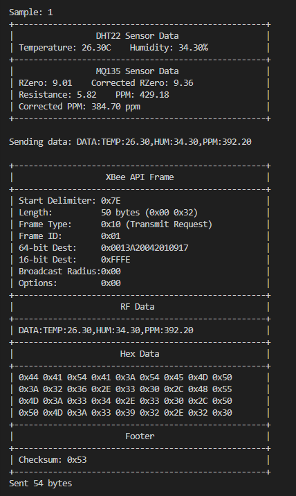

# CO Sensor Monitoring System

## Overview
This project implements a carbon monoxide (CO) and air quality monitoring system using MQ135 gas sensors and DHT22 temperature/humidity sensors on a Raspberry Pi Pico or other MicroPython-compatible microcontroller. The system can operate standalone or as part of a wireless sensor network using XBee modules. This sensor node is designed to send data to the [CO Monitoring Gateway](https://github.com/adstanley/CO-Monitor-Gateway) repository which handles data collection, visualization, and alerts.

## Features
- Cost-effective CO and air quality monitoring using MQ135 gas sensors
- Temperature and humidity measurement with DHT22 sensors
- Temperature and humidity compensation for improved accuracy
- Sensor calibration capabilities
- XBee wireless communication in API mode
- Real-time data transmission and monitoring
- Robust error handling and recovery

## Hardware Requirements
- Raspberry Pi Pico or compatible microcontroller with MicroPython support
- MQ135 gas sensor
- DHT22 temperature and humidity sensor
- XBee modules (optional for wireless communication)
- External power supply for stable operation

## Pin Configuration
- DHT22 data pin: GPIO 2
- MQ135 analog pin: ADC0
- MQ135 digital pin: GPIO 2 (configurable)
- UART TX (XBee communication): GPIO 0
- UART RX (XBee communication): GPIO 1

## Installation
1. Flash MicroPython to your Raspberry Pi Pico.
2. Copy the main script to your device as `main.py`.
3. Configure any necessary parameters (see Configuration section).
4. Connect sensors according to the pin configuration.
5. Power up the system.

## Configuration
The following parameters can be adjusted in the `main()` function:

```python
# Initialize sensors
mq135_sensor = MQ135(0)  # ADC pin for MQ135
dht_sensor = EnhancedDHT22(Pin(2, Pin.IN))  # GPIO pin for DHT22

# XBee communication parameters
xbee = APISend(uart_id=0, baudrate=9600, tx_pin=0, rx_pin=1)

# Update interval (seconds)
update_time = 1

# Enable/disable data transmission
transmit = True  # Set to False for local monitoring only
```

## Code Structure
The codebase is organized with a modular structure to make it easier to comprehend and extend. You can view an interactive visualization of the code structure [here](https://htmlpreview.github.io/?https://github.com/adstanley/COmonitor/blob/main/Structure.html).

Key classes include:
- `MQ135`: Handles gas detection with temperature/humidity compensation
- `EnhancedDHT22`: Provides reliable temperature and humidity readings
- `Node`: Coordinates readings between sensors and handles data presentation
- `APISend`: Manages XBee wireless communication

## Classes and Functionality

### MQ135
The MQ135 class handles gas detection with temperature and humidity compensation for improved accuracy.

Key methods:
- `get_voltage()`: Read voltage from the sensor
- `get_ppm()`: Get parts per million of CO2/pollutants
- `get_corrected_ppm(temperature, humidity)`: Get temperature/humidity compensated readings
- `get_danger_level()`: Get human-readable danger level assessment
- `get_debug_info()`: Get comprehensive sensor diagnostics

### EnhancedDHT22
Provides reliable temperature and humidity readings with error handling.

Key methods:
- `read()`: Read from the sensor with retry logic
- `temperature_celsius()`: Get temperature in Celsius
- `temperature_fahrenheit()`: Get temperature in Fahrenheit
- `humidity()`: Get relative humidity percentage

### Node
Coordinates readings between multiple sensors and handles data presentation.

Key methods:
- `update_environment_data()`: Update temperature and humidity readings
- `read_mq135_values()`: Read values from MQ135 sensor
- `print_sensor_data()`: Print formatted sensor data
- `continuous_monitoring()`: Continuously monitor and optionally transmit data

### APISend
Handles XBee communication in API mode for wireless data transmission.

Key methods:
- `simple_api_send()`: Send data using 16-bit addressing
- `simple_api_send_64bit()`: Send data using 64-bit addressing
- `send_at_command()`: Send AT commands to XBee

## Usage

### Local Monitoring
For standalone operation without data transmission:

```python
# In main()
transmit = False
```

### Networked Monitoring
For operation with data transmission to a coordinator/gateway:

```python
# In main()
transmit = True
```

### Integration with CO Monitoring Gateway
This sensor node sends data to the [CO Monitoring Gateway](https://github.com/adstanley/CO-Monitor-Gateway) which provides:

- Data collection from multiple sensor nodes
- Web dashboard for real-time monitoring
- Historical data storage and visualization
- Alert system for dangerous CO levels
- API for third-party integrations

See the [CO Monitoring Gateway documentation](https://github.com/adstanley/CO-Monitor-Gateway) for setup instructions to complete your monitoring network.

### Data Format
When transmitting, data is sent in the following format:
```
DATA:TEMP:23.50,HUM:45.20,PPM:432.15
```

### Example Output
Below is an example of the system output showing sensor readings and XBee API frame details:



## Troubleshooting
- If you encounter "Input/output error" messages, check your hardware connections
- For XBee communication issues, verify XBee module configuration and addressing
- To test UART communication, use the `test_uart_communication()` function

## Development
The codebase is designed to be modular and extensible. Key areas for customization:

- Sensor calibration parameters in the `MQ135` class
- Communication protocol in the `APISend` class
- Data presentation format in the `Node` class

## License
MIT

This project is licensed under the MIT License - see the [LICENSE](LICENSE) file for details